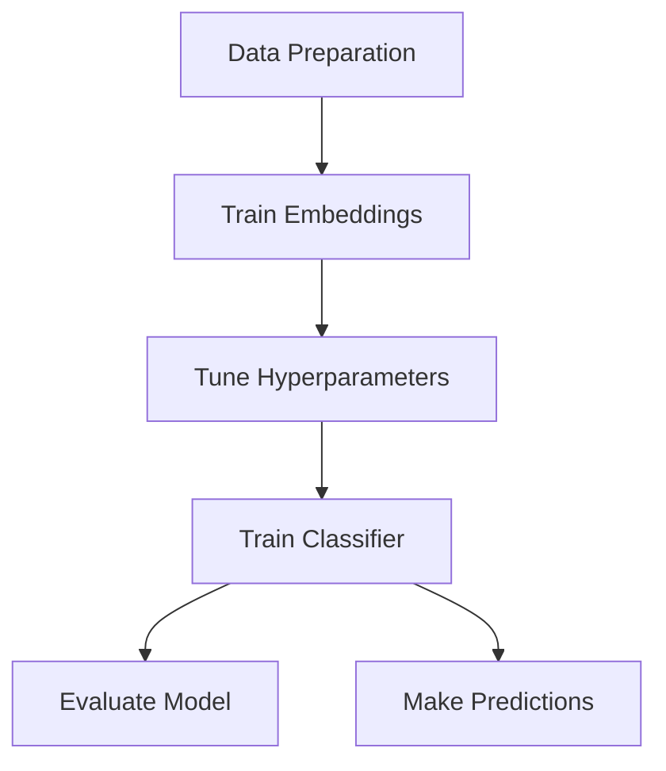

# BERT Embedding Classifier Tuner

## Overview

BERT Embedding Classifier Tuner is a modular framework for fine-tuning and deploying BERT-based text classifiers. It optimizes text classification by:

1. Learning better text representations through triplet loss
2. Systematically tuning classifier architecture with Optuna
3. Providing robust evaluation and prediction tools

The system uses a pipeline approach that separates embedding generation from classifier training, allowing efficient experimentation and optimization.


## Core Features

- **Enhanced Embeddings**: Uses triplet loss to create better text representations
- **Hyperparameter Optimization**: Automatically tunes classifier architecture and training parameters
- **Resource Efficiency**: Pre-computes embeddings to avoid redundant BERT processing
- **Evaluation Tools**: Provides cross-validation, confusion matrices, and misclassification analysis
- **Hardware Optimization**: Supports CUDA, MPS (Apple Silicon), and CPU deployments

## Technical Components

The framework consists of five main modules, each with a dedicated purpose:

| Module | Purpose | Documentation |
|--------|---------|---------------|
| TripletTraining | Learns improved text embeddings using triplet loss | [TripletTraining](triplet-training) |
| TuneBert | Optimizes classifier architecture and hyperparameters | [TuneBert](tune-bert) |
| BertClassification | Trains the classifier on pre-computed embeddings | [BertClassification](bert-classification) |
| Evaluation | Provides detailed model evaluation and analysis | [Evaluation](evaluation) |
| Predict | Applies the trained model to new text data | [Predict](predict) |

## Typical Workflow



1. **Data Preparation**: Format your data as a CSV with 'text' and 'labels' columns
2. **Train Embeddings**: Use TripletTraining to learn better text representations
3. **Tune Hyperparameters**: Optimize classifier architecture with TuneBert
4. **Train Classifier**: Train the classifier with BertClassification
5. **Evaluate**: Use Evaluation to assess model performance
6. **Predict**: Apply the model to new text with Predict

## Configuration

The project uses a central `config.yml` file that controls all aspects of the pipeline:

```yaml
BASE_ROOT: "/path/to/outputs"
DATA_ROOT: "/path/to/data"
MODEL: "all-mpnet-base-v2"
# Additional configurations...
```

## Hardware Requirements

- Python 3.7+
- PyTorch 1.9+
- 8GB+ RAM (16GB+ recommended for larger models)
- GPU support for:
  - NVIDIA GPUs with CUDA
  - Apple Silicon Macs with MPS

## Getting Started

See the [Installation Guide](installation) and [Quick Start](quick-start) pages for setup instructions and initial usage.
