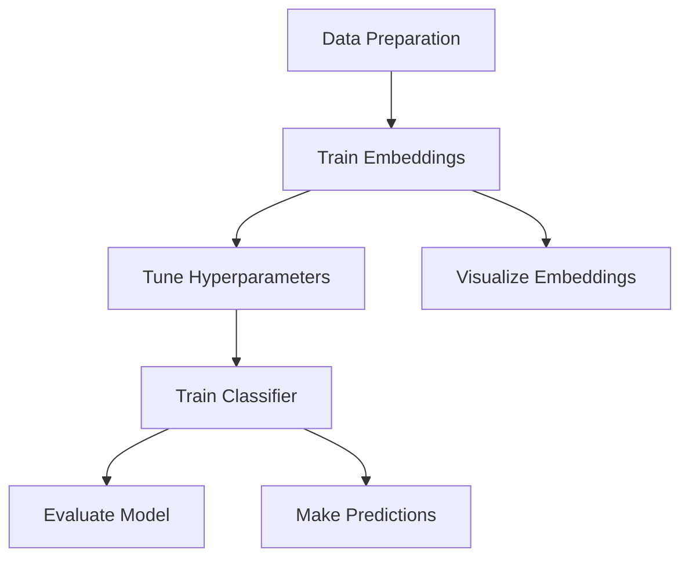

# BERT Embedding Classifier Tuner

## Overview

BERT Embedding Classifier Tuner is a modular framework for fine-tuning and deploying BERT-based text classifiers. It optimizes text classification by:

1. Learning better text representations through triplet loss
2. Systematically tuning classifier architecture with Optuna
3. Providing robust evaluation and prediction tools
4. Visualizing embedding spaces to validate representation quality

The system uses a pipeline approach that separates embedding generation from classifier training, allowing efficient experimentation and optimization.


## Core Features

- **Enhanced Embeddings**: Uses triplet loss to create better text representations with visualization
- **Hyperparameter Optimization**: Automatically tunes classifier architecture and training parameters
- **Data Integrity**: Generates embeddings on-the-fly to prevent data leakage
- **Evaluation Tools**: Provides cross-validation, confusion matrices, and misclassification analysis
- **Hardware Optimization**: Supports CUDA, MPS (Apple Silicon), and CPU deployments
- **Logging System**: Captures and organizes outputs across all modules

## Technical Components

The framework consists of five main modules and a demos directory, each with a dedicated purpose:

| Module | Purpose | Documentation |
|--------|---------|---------------|
| FTC/TripletTraining.py | Learns improved text embeddings using triplet loss | [TripletTraining](triplet-training) |
| FTC/TuneBert.py | Optimizes classifier architecture and hyperparameters | [TuneBert](tune-bert) |
| FTC/BertClassification.py | Trains the classifier using on-the-fly embeddings | [BertClassification](bert-classification) |
| FTC/Evaluation.py | Provides detailed model evaluation and analysis | [Evaluation](evaluation) |
| FTC/Predict.py | Applies the trained model to new text data | [Predict](predict) |
| FTC_utils/ | Utility modules for logging, environment, and file operations | [Configuration](configuration) |

## Typical Workflow



1. **Data Preparation**: Format your data as a CSV with 'text' and 'labels' columns
2. **Train Embeddings**: Use TripletTraining to learn better text representations
3. **Visualize Embeddings**: Inspect embedding quality with t-SNE visualization
4. **Tune Hyperparameters**: Optimize classifier architecture with TuneBert
5. **Train Classifier**: Train the classifier with BertClassification
6. **Evaluate**: Use Evaluation to assess model performance
7. **Predict**: Apply the model to new text with Predict

## Configuration System

The project uses a sophisticated configuration system with a central `config.yml` file:

```yaml
# Base output directory
BASE_ROOT: &BASE_ROOT "/path/to/outputs"

# Directory structure with path joining
DATA_ROOT: &DATA_ROOT !join [ *BASE_ROOT, "/data" ]
CKPT_ROOT: !join [ *BASE_ROOT, "/checkpoints" ]
LEARNING_CURVES_DIR: !join [ *BASE_ROOT, "/evaluation" ]

# Model and training parameters
SEED: 42
MODEL: "all-mpnet-base-v2"
BATCH_SIZE: 64
```

The configuration system uses YAML anchors, references, and custom tags to create a maintainable directory structure. See the [Configuration](configuration) page for more details.

## Interactive Demos

The project includes ready-to-use demos for each component:

```bash
# Run the triplet training demo with visualization
python demos/triplet_training_demo.py --epochs 5 --visualize --sample-data

# Try the evaluation demo with cross-validation
python demos/evaluation_demo.py --folds 3 --epochs 3 --ngrams all --sample-data
```

Each demo accepts a `--sample-data` flag to use built-in example data, making it easy to experiment with the system.

## Hardware Requirements

- Python 3.7+
- PyTorch 1.9+
- 8GB+ RAM (16GB+ recommended for larger models)
- GPU support for:
  - NVIDIA GPUs with CUDA
  - Apple Silicon Macs with MPS
- Disk space: 1GB+ for model files and embeddings

## Getting Started

See the [Installation Guide](installation) and [Quick Start](quick-start) pages for setup instructions and initial usage.
